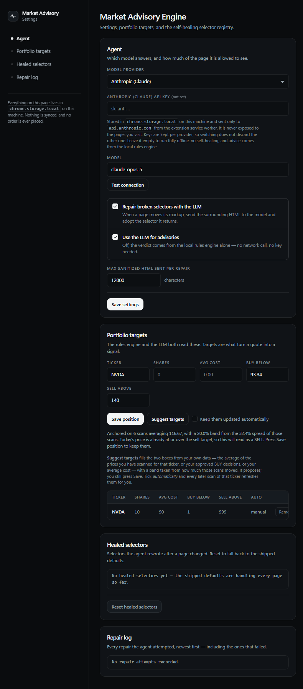

# Self-Healing Market Scraper & Advisory Engine

A Chrome extension (Manifest V3) that reads the stock quote page you are already
looking at, repairs its own DOM selectors with an LLM when the site changes its
markup, and proposes **BUY / SELL / HOLD** with an explicit rationale.

It never places an order. Every recommendation ends at a confirmation modal
where you approve, reject, or override — and the decision is recorded locally.

## Install (unpacked)

```bash
npm install && npm run check
```

Then in Chrome or Edge: `chrome://extensions` (or `edge://extensions`) → enable
**Developer mode** → **Load unpacked** → select this folder.

`npm run package` also writes a clean copy with nothing but `manifest.json` and
`src/` in it:

```
dist/extension/                        point "Load unpacked" here
dist/self-healing-market-scraper-1.0.0.zip   send this to someone else
```

A zip cannot be installed directly — "Load unpacked" wants a folder, and a
`.crx` needs a signing key — so whoever receives the zip unpacks it first and
loads the folder inside. Open a quote page (Yahoo Finance, Google Finance,
MarketWatch, stockanalysis.com, or anything else), click the toolbar icon, and
press **Scan this tab**.

### The setup guide

A fresh install opens `src/welcome.html` in a tab once: five steps covering what
the extension is, the scan/read/decide loop, whether a model or the local rules
engine answers, your first watched ticker, and where to go next. Nothing in it
is mandatory and every step can be skipped — it writes only what you actually
fill in, and each step persists as you leave it, so a guide abandoned halfway
still leaves a working configuration behind.

It never reopens by itself. Reach it again from the **?** button in the popup,
or from **Settings → Getting started**, which also shows a live checklist of
what is configured — read back out of storage rather than out of what some
earlier screen intended to write.

Optionally open the extension's options page and paste an API key. Two
providers ship: **Anthropic (Claude)** by default, and **Groq** for when an
Anthropic key is not available — Groq's free tier runs the whole loop. Pick one
in the dropdown, paste its key, and press **Test connection** to confirm it
before you rely on it. Keys are stored per provider, so switching does not
discard the other one.
Without a key everything still works: no self-healing, and advisories come from
the local rules engine.

## File tree

```
manifest.json              MV3 manifest — activeTab, storage, scripting, offscreen
src/
  background.js            Service worker: injection, healing loop, LLM calls, router
  content.js               Injected extractor (classic script — no ES imports)
  offscreen.html/.js       DOM parser for sanitizing scraped HTML off the active tab
  theme.css                The design system: tokens, material, type, controls — every surface
  popup.html/.css/.js      Popup: quote card, advisory card, approve/reject/override
  options.html/.css/.js    Getting started, API key, model, portfolio targets, selector registry
  welcome.html/.css/.js    The five-step setup guide, opened once on install
  icons/                   Generated PNGs (scripts/make-icons.mjs)
  lib/
    constants.js           Message types, storage keys, defaults
    normalize.js           Price/percent/volume/ticker parsing → the scraping payload
    selectors.js           Shipped selector registry + candidate resolution order
    sanitize.js            HTML sanitizer used by the offscreen document
    advisor.js             Deterministic rules engine + advisory schema validation
    storage.js             Typed chrome.storage.local accessors
    llm.js                 Provider-agnostic client: structured output, retries, timeouts
    targets.js             Suggests buy/sell targets from your own scans and decisions
    verify.js              Cross-scan checks that catch a page-global price
    extract-core.js        Headless extraction, for HTML fetched without a browser
    alerts.js              Alert rules: target, percent, level, advisory flip
    providers.js           Anthropic and Groq wire formats, and the active-provider resolver
    brightdata.js          Scraping Browser endpoint parsing, redaction, bridge address rules
agent/                     The Bright Data half. Node, not the browser — see below.
  config.mjs               Endpoint, geo pin, bridge and model credentials, all from .env
  brightdata.mjs           The Scraping Browser session, and the content-script injection
  healing.mjs              The self-healing loop, over a three-method page driver
  scrape.mjs               One scrape end to end: open, extract, repair, verify, persist
  registry.mjs             agent/state/registry.json — healed selectors, heal log, snapshots
  server.mjs               The loopback bridge the extension calls (npm run agent)
  cli.mjs                  The same scrape at a terminal (npm run brightdata)
web/                       The dashboard. Served two ways from one codebase:
  index.html               inside the extension (chrome-extension://<id>/web/index.html)
  dashboard.css            and as a plain static site (npm run web)
  js/bridge.js             Transport adapter: direct messaging, or externally_connectable
  js/state.js              Store, refresh loop, derived views
  js/render.js             Every DOM node — textContent only, never innerHTML
  js/alerts-ui.js          Alert feed, rule editor, toasts, monitoring control
  js/sparkline.js          Hand-rolled inline-SVG price series
  vendor/                  Byte-identical copies of shared files (npm run web:sync)
scripts/
  validate.mjs             Static bundle validation (npm run lint)
  make-icons.mjs           Dependency-free PNG icon generator
  package.mjs              Builds dist/<name>-<version>.zip (npm run package)
  web-sync.mjs             Mirrors shared files into web/vendor/ (npm run web:sync)
  serve-web.mjs            Zero-dependency static server for web/ (npm run web)
e2e/
  harness.mjs              Shared browser plumbing (staging, popup driver)
  quote-page.mjs           Live-site run: scan → advise → approve → log
  self-healing.mjs         Deterministic repair run against a mangled page
  provider-check.mjs       Confirms a provider answers from the service worker
  live-quote.mjs           Real key, live page: a genuine repair and advisory
  auto-targets.mjs         Target suggestion across repeated scans, offline
  dashboard.mjs            The dashboard on both routes, and the external boundary
  brightdata.mjs           The whole Bright Data path, against the real service
docs/
  DEMO.md                  Three-minute demo script, with real screenshots
  env.mjs                  Reads the gitignored .env the runs take keys from
test/                      446 tests: node:test + jsdom
```

## The dashboard

The popup shows one ticker: whichever tab you just scanned. The dashboard shows
all of them at once, keeps them refreshed while you are not looking, and tells
you when one crosses a line you drew.

It is one codebase served two ways, and the only difference between them is how
a message reaches the service worker:

```bash
# 1. Inside the extension. No server, no setup, nothing to configure.
#    Options page -> "Open dashboard", or open this directly:
#    chrome-extension://<your-extension-id>/web/index.html

# 2. As a real website.
npm run web            # http://localhost:8080
```

The website route reaches the extension through `externally_connectable`, which
covers `localhost` and `127.0.0.1` on any port. It needs the extension's ID
once — the **Open dashboard** button on the options page fills that in for you,
and the page remembers it. Deploying it elsewhere means adding that origin to
`externally_connectable.matches` in `manifest.json` first; it cannot be
configured at runtime, by design.

Nothing is stored in the website. It is a view: the watchlist, the price
history, the API key and every scrape live in the extension, on your machine.
With the extension disabled, the page says so rather than showing a blank grid.

### Background refresh

A refresh re-reads a quote page you do not have open, by whichever route is
cheaper:

1. **Fetch the page and parse it.** Silent, fast, no tab appears. Works only on
   a server-rendered quote page.
2. **Read it through the Bright Data Scraping Browser.** A real Chrome somewhere
   else, with a CAPTCHA solver and a pinned exit country, running the same
   self-healing loop. Off until configured — see
   [Bright Data Scraping Browser](#bright-data-scraping-browser) — and where it
   sits in this order is a setting.
3. **Open it in a background tab and run the real content script.** Slower and
   briefly visible in the tab strip, but it is a genuine render, so it works
   everywhere the popup does — including the self-healing repair path.

Route 1 is tried first and the rest catch what it cannot read, which is most
JavaScript-heavy finance sites. Routes 1 and 3 read the page from *your*
browser, so both need you to have granted access to that host; see the security
notes below. Route 2 does not touch it at all — the agent's browser does — so it
needs access to the agent instead, and can read a host you have never granted. A ticker you add by symbol alone
defaults to `stockanalysis.com`, which renders server-side and so usually works
by the fast path.

A refresh writes nothing it is unsure of. A page reporting a different ticker
than the one asked for, a price the host reports identically for two different
stocks, or a page with no readable price all end as a recorded failure on that
ticker's card rather than as a number in your history.

### Alerts

Four rule kinds, all evaluated locally:

| Rule | Fires when |
| --- | --- |
| **target** | the price reaches `target_buy_below` or `target_sell_above` — the targets already on your position, so anything set in the options page or proposed by the target suggester alerts with nothing further to configure |
| **percent** | it moves more than *n*%, measured from the previous reading, the oldest reading held, your average cost, or the last alert |
| **level** | it goes above or below a plain price you name |
| **advice_flip** | the recommendation itself changes (HOLD → BUY) |

Every rule fires on a **crossing**, not on a state: a price that stays above
your sell target is one event, not one every fifteen minutes. A per-rule
cooldown catches the rest. Nothing fires on a price that failed to parse — a
missing number is not a fall to zero.

An alert arrives on three channels at once, because the first can be silently
suppressed by the operating system: an OS notification, a count on the toolbar
icon, and a feed in the dashboard.

**Background monitoring is off until you switch it on.** When it is on, a
`chrome.alarms` tick refreshes the monitored tickers on your chosen interval and
evaluates the rules against what it read. `advice_flip` uses the free local
rules engine unless you opt into `alertsUseLlm` — a model call every fifteen
minutes per ticker is real money spent on a question that mostly answers "HOLD,
same as last time".

## How the self-healing loop works

1. `background.js` builds the ordered selector candidates for the tab's host:
   **healed selector → host defaults → related-host defaults → generic fallbacks.**
2. `content.js` runs them. Anything it cannot find is returned as a failure with
   the surrounding container HTML (scripts and styles already stripped).
3. The worker sends that container to the **offscreen document**, which parses it
   with `DOMParser` and strips ads, nav chrome, and volatile attributes while
   keeping every `data-*` / `aria-*` / `id` / `class` hook a selector could use.
4. The sanitized fragment goes to Claude with a `json_schema` structured output
   asking for a replacement CSS (or XPath) selector.
5. The proposal is checked twice before it is trusted: locally
   (`isPlausibleSelector` rejects `*`, `body`, HTML fragments, oversized strings)
   and then **in the live page** via `VALIDATE_SELECTOR`, which requires a single
   match that looks like a value rather than a container.
6. Only a selector that survives both is written to `chrome.storage.local` and
   used immediately — no page reload.

## Bright Data Scraping Browser

Some quote pages will not open for a browser extension. They geo-gate, they put
a CAPTCHA in front of the price, they rate-limit one residential IP after a
dozen reads, or they simply refuse a client that looks automated. `agent/` reads
those pages through **Bright Data's Scraping Browser** — a real Chrome,
somewhere else, driven over the DevTools Protocol — and runs the *identical*
self-healing loop inside it.

```bash
cp .env.example .env          # paste the wss:// endpoint into BRIGHTDATA_BROWSER_URL
npm run brightdata:check      # do the credentials work?
npm run brightdata -- AAPL    # scrape one ticker, repairing whatever is broken
npm run agent                 # serve it to the extension on 127.0.0.1:8791
```

### The endpoint, and the password that is not a password

The Scraping Browser zone page gives you one line:

```
wss://brd-customer-<CUSTOMER ID>-zone-<ZONE NAME>:<PASSWORD>@brd.superproxy.io:9222
```

Copy it **after** pressing the reveal control. Until you do, the console prints
the password as a row of asterisks, and that masked string copies perfectly
cleanly — pasted into a config it fails with a bare authentication error, which
sends you checking the zone name, the customer id, your plan and your firewall,
i.e. everything except the thing that is wrong. The parser refuses it by name
instead:

> That password is the console's mask (a row of asterisks), not the password
> itself. Reveal it on the Bright Data zone page, then copy the endpoint again.

`BRIGHTDATA_AUTH` (the bare `user:password` pair Bright Data's own code samples
use) and a `BRIGHTDATA_CUSTOMER` / `_ZONE` / `_PASSWORD` triple are both accepted
as alternatives. The credentials never leave `.env`: they are not stored in the
extension, not sent over the bridge, and every path that prints the endpoint —
the CLI banner, `/health`, the options page — prints the redacted form.

### Pin the exit country

`BRIGHTDATA_COUNTRY=us` is not decoration. Without it the session leaves from
wherever Bright Data has capacity, and the site serves what that country gets: a
European exit node turns `google.com/finance` into `consent.google.com`, which
has no quote on it at all. That failure is genuinely confusing, because the
scraper is working perfectly and correctly reports that the page it reached has
no price — so a redirect off the requested host is now detected and reported as
itself, with the fix named:

> the site redirected to consent.google.com, which is a consent page rather than
> the quote — pin the session to a country that is not gated, with
> BRIGHTDATA_COUNTRY in the agent's .env

`BRIGHTDATA_CITY` and `BRIGHTDATA_STATE` work the same way.

### Why the extension cannot do this itself

It is not a design preference. That endpoint carries its credentials in the URL,
and the HTML standard requires `new WebSocket()` to throw a `SyntaxError` when
the URL "includes credentials". Chrome implements exactly that, and the
WebSocket API exposes no request headers, so the `Authorization: Basic` route
that Bright Data's C# sample takes is not available in a browser either. An MV3
service worker is a page context and is bound by both rules.

So the session runs in Node, where puppeteer-core can dial the endpoint
directly, and the extension reaches it over a loopback HTTP bridge. Two things
guard that bridge, because "it is only on localhost" is not a boundary — every
page in your browser can reach localhost too:

- **an origin allowlist** — only `chrome-extension://` and loopback origins get
  a CORS preflight through, so a random site cannot spend your Bright Data hours
  from a background tab;
- **an optional shared token** (`BRIGHTDATA_BRIDGE_TOKEN`), checked on every
  route. Worth setting.

### It is the same self-healing loop, not a second one

The agent does not carry its own extractor. It injects `src/content.js` — the
extension's actual content script — into the remote page and calls the same
three handlers the service worker calls in a real tab:

| Message | What it does |
| --- | --- |
| `EXTRACT` | run the ordered selector candidates, return values and the containers for whatever missed |
| `VALIDATE_SELECTOR` | run one proposed selector *in the live page* and report what it resolved to |
| `CAPTURE_CONTAINER` | hand back the surrounding markup for one field |

Injection goes through `Runtime.evaluate` rather than a `<script>` tag, because a
`<script>` tag is subject to the target page's Content-Security-Policy and
financial sites routinely ship one strict enough to drop it.

Everything downstream is shared code: the same candidate order, the same
sanitizer, the same prompt, the same `isPlausibleSelector` and `valueFitsField`
refusals, the same one retry carrying the rejection back to the model, the same
page-global-price check. A repair found out there is a repair the popup would
have made — which is why it can simply be merged back in.

### The registry is reconciled, not duplicated

The agent keeps its healed selectors in `agent/state/registry.json`, because it
has to work with no browser running at all. Every scrape carries the extension's
registry out and the agent's back, and both sides merge on newest `healed_at`
per host and field. So a selector repaired through Bright Data is one the popup
already has the next time you scan that host, and it shows up in the same
**Selectors** and **Repair log** tabs.

### Using it from the extension

Options → **Bright Data**. Set the agent's address, grant access to it, pick
where it sits in the background-refresh order, and press **Test agent**:

| Mode | Refresh order |
| --- | --- |
| `fallback` (default) | plain fetch → Bright Data → a local background tab |
| `first` | Bright Data → plain fetch → a local background tab |
| `only` | Bright Data, and report a failure rather than opening a tab |

One consequence worth stating: the local routes read the quote page from *your*
browser and so need that host's permission, while the Bright Data route never
touches it — the agent's browser does. A host you have not granted is still
readable that way, and `only` mode never opens a tab at all.

The panel has no field for the Bright Data password, and never will: it belongs
in the agent's `.env`, on the machine that dials the endpoint.

## Advisory & human-in-the-loop

`adviseOn()` sends the normalized snapshot plus your own position and targets to
Claude with the documented output schema, then re-validates the answer. If the
model is unavailable, refuses, or returns something off-schema, the popup falls
back to `heuristicAdvice()` — a deterministic rules engine over your targets —
and says so on the card.

`user_action_required` is forced to `true` on every path, and recorded decisions
always carry `executed: false`. The extension has no broker integration and no
code path that transmits an order.

## Data shapes

Scraping payload (`chrome.storage.local` → `snapshots[TICKER]`):

```json
{
  "ticker": "AAPL",
  "current_price": 224.50,
  "currency": "USD",
  "change_percentage": "+1.80%",
  "change_value": 1.8,
  "volume": 52300000,
  "news": ["Apple beats earnings expectations again"],
  "extracted_at": "2026-08-19T20:55:00Z",
  "source_url": "https://finance.example.com/quote/AAPL",
  "selectors_used": { "price_selector": "#quote-header-info span[data-reactid]" }
}
```

Watchlist entry (`chrome.storage.local` -> `watchlist[TICKER]`):

```json
{
  "ticker": "AAPL",
  "source_url": "https://stockanalysis.com/stocks/aapl/",
  "monitor": true,
  "added_at": "2026-08-19T20:55:00Z",
  "last_refreshed_at": "2026-08-22T09:15:00Z",
  "last_method": "fetch",
  "last_error": null,
  "needs_permission": null
}
```

Alert rule (`alert_rules[TICKER][]`) and the alert it raises (`alerts[]`):

```json
{
  "id": "AAPL-percent-m1k2j3",
  "ticker": "AAPL",
  "kind": "target | percent | level | advice_flip",
  "enabled": true,
  "threshold": 5,
  "direction": "up | down | both",
  "baseline": "previous_scan | session_open | avg_cost | last_alert",
  "cooldown_minutes": 60,
  "last_fired_at": null,
  "last_fired_price": null
}
```

```json
{
  "id": "AAPL-percent-m1k2j3-1755859200000",
  "rule_id": "AAPL-percent-m1k2j3",
  "ticker": "AAPL",
  "kind": "percent",
  "title": "AAPL moved +5.20%",
  "body": "Now 224.50, against 213.40 — the previous reading.",
  "direction": "up",
  "price": 224.50,
  "currency": "USD",
  "at": "2026-08-22T09:15:00Z",
  "seen": false
}
```

Advisory output:

```json
{
  "ticker": "AAPL",
  "action": "BUY | SELL | HOLD",
  "confidence_score": 0.85,
  "rationale": "Clear, concise paragraph explaining market context and technical drivers.",
  "user_action_required": true
}
```

## Security and privacy notes

- **Permissions granted at install are exactly** `activeTab`, `storage`,
  `scripting`, `offscreen`, `alarms`, `notifications`, plus host permissions for
  `https://api.anthropic.com/*` and `https://api.groq.com/*` — the two model
  providers, and nothing else. There are no declared content scripts, so the
  extension has no standing access to any site.
- **Background refresh needs site access, and asks for it one host at a time.**
  Scanning the tab you are looking at still needs nothing: that is what clicking
  the toolbar icon grants. Re-reading a ticker you are *not* looking at is
  different — the page is not open, so the extension needs standing access to
  that one site. Those are `optional_host_permissions`: **nothing is granted at
  install**, each origin is requested separately from a real click, and you can
  revoke any of them from the options page or `chrome://extensions`. Until you
  grant one, background refresh for that ticker refuses and says so.
- **The dashboard's line in is narrow.** `externally_connectable` lists
  `http://localhost/*` and `http://127.0.0.1/*` only, and the worker answers
  such a page from an explicit allowlist (`EXTERNAL_ALLOWED` in
  `src/lib/constants.js`). `TEST_PROVIDER`, `SCRAPE_ACTIVE_TAB`, `GET_STATE` and
  `RESET_SELECTORS` are deliberately not on it, and the API key never crosses
  that boundary in either direction.
- **The API key lives in the service worker.** It is stored in
  `chrome.storage.local`, sent only to the selected provider's host, and is never exposed
  to the content script or included in the popup's state (`GET_STATE` returns
  `hasApiKey`, not the key).
- **Scraped text is never treated as markup.** The popup renders everything with
  `textContent`; there is no `innerHTML` assignment anywhere in the UI.
- **Only a sanitized fragment leaves the browser** during a repair — the failing
  container, capped at a configurable character budget (12,000 by default), with
  scripts, styles, forms, and ad blocks removed.
- **The Bright Data credentials never enter the extension.** They live in the
  agent's gitignored `.env`, on the machine that dials the endpoint. The options
  page has no field for them, `/health` returns the redacted endpoint, and the
  parser refuses to put a password in an error message.
- **The bridge is loopback, origin-checked and optionally token-checked.** Being
  on `127.0.0.1` is not by itself a boundary, because every page in the browser
  can reach `127.0.0.1` too — so the agent refuses a CORS preflight from any
  origin that is not `chrome-extension://` or loopback, and refuses every request
  without the shared token once `BRIGHTDATA_BRIDGE_TOKEN` is set. The extension
  cannot reach it at all until you grant that origin from the options page.

## Commands

```bash
npm run check     # static validation + the full test suite (428 tests)
npm run web       # serve the dashboard at http://localhost:8080
npm run web:sync  # refresh web/vendor/ from src/ (the lint fails if it drifts)
npm run package   # dist/self-healing-market-scraper-<version>.zip
npm run e2e       # drive the real extension in a real browser, live site
                  #   EXT_SOURCE=dist/extension npm run e2e  tests the built copy
npm run e2e:heal  # drive the repair loop against a mangled page, offline
npm run e2e:provider   # does the configured key and model actually answer?
npm run e2e:live       # real repair + real advisory on a live page (spends tokens)
npm run e2e:dashboard  # the dashboard on both routes, offline, plus the external boundary

# Bright Data (agent/) — these reach a real remote browser and cost real minutes
npm run brightdata:check    # do the Scraping Browser credentials work?
npm run brightdata -- AAPL  # one scrape at a terminal, repairing what is broken
npm run brightdata -- --registry     # what has been healed so far
npm run agent               # the loopback bridge the extension calls
npm run e2e:brightdata      # the whole Bright Data path, against the real service
```

### Credentials for the e2e runs

The browser runs read their key from a gitignored `.env`, so it never lands in a
shell history and nothing prints it back:

```bash
cp .env.example .env
# paste your key into GROQ_API_KEY (or ANTHROPIC_API_KEY), then:
npm run e2e:provider   # confirms the key works, and says which model answered
npm run e2e:live       # one real scan: repair a stale selector, write an advisory
```

`.env` feeds the test tooling only — the extension itself takes its key from the
options page. `npm run package` never includes it. With no key configured,
`npm run e2e:provider` still runs as a transport-only check, and everything else
falls back to the local rules engine.

`npm run lint` alone runs `scripts/validate.mjs`, which catches the failures
Chrome only reports at load time: manifest shape, permission drift, missing
files, unresolvable module imports, and ES syntax sneaking into `content.js`.

`npm run package` writes a zip containing exactly `manifest.json` and `src/` —
no tests, no scripts, no repo metadata — for upload or for handing to someone
who just wants to unzip and **Load unpacked**. It is written with `node:zlib`,
so packaging adds no dependency either.

`npm run e2e` takes an optional URL (`npm run e2e -- https://…`) and writes
screenshots to `e2e/shots/`. Both e2e scripts run from a throwaway copy of the
extension with `host_permissions` widened for the site under test: `activeTab`
is only granted by a human clicking the toolbar icon, and no automation protocol
can produce that click. The shipped manifest keeps its narrow permission set.

Chrome 137 and later ignore `--load-extension`, so an up-to-date Chrome starts
cleanly with no extension in it. The harness detects that — it waits for the
service worker and moves on to the next installed browser (Edge, Chromium) if it
never appears — and prints which browser it settled on. `BROWSER_PATH=…` pins
one explicitly, in which case no fallback is attempted. None of this affects the
extension itself: Chrome installs it normally through **Load unpacked**.

## Suggested targets

Targets are what turn a quote into a signal — without them every answer is a
low-confidence HOLD — and typing two numbers per ticker is the step people skip.
So the options page offers to work them out, from your own data only:

| Anchor, first available | Meaning |
| --- | --- |
| The average of the prices you have scanned for that ticker | what it has traded at while you were watching |
| The average price of your approved BUY decisions | what you have actually paid |
| Your average cost | your book cost |
| Today's price | all there is on a first scan |

The band either side comes from how much those scans actually moved (their
standard deviation, clamped to 3–20%), or a flat 5% when there is not enough
history. Then `buy_below = anchor × (1 − band)` and
`sell_above = anchor × (1 + band)`.

That is arithmetic on your own data. It does not ask a model what a stock is
worth, and it never presents a forecast as a fact.

**Suggest targets** fills the two boxes and tells you what it anchored on — you
still press Save. Tick **Keep them updated automatically** and every later scan
of that ticker refreshes them, and the popup says so each time it happens.
Positions left manual are never rewritten.



Each usable scan appends one point to `price_history` (60 per ticker, oldest
dropped), which is what the averaging reads.

## Choosing a provider

The reasoning work — repair a selector, write an advisory — is the same request
in both cases: a system prompt, one user message, and a JSON schema the answer
must satisfy. Only the wire format differs, so each provider in
[`src/lib/providers.js`](src/lib/providers.js) owns exactly four things: its auth
headers, its request body, how to pull the JSON back out, and where its error
message lives.

| | Anthropic | Groq |
| --- | --- | --- |
| Endpoint | `/v1/messages` | `/openai/v1/chat/completions` |
| Auth | `x-api-key` | `Authorization: Bearer` |
| Schema enforcement | `output_config.format` | `response_format.json_schema` |
| Model list in options | fixed | **Load models from provider** reads the live catalogue |
| Default model | `claude-opus-5` | `openai/gpt-oss-120b` |

Not every model behind an OpenAI-compatible endpoint supports strict
`json_schema`. When one rejects it, the client retries the same request once
with the schema moved into the prompt, so a model that only does `json_object`
still works. Answers wrapped in a code fence or a sentence of prose are parsed
too, because smaller models do that.

Both endpoints have been confirmed reachable from the MV3 service worker
(`npm run e2e:provider`), and the full repair loop has been driven end to end in
both wire formats (`npm run e2e:heal`, `npm run e2e:heal -- groq`).

It has also been run for real: with a Groq key on `openai/gpt-oss-120b`, a scan
of stockanalysis.com repaired the stale `change_percentage` hook to
`div.mb-5 > div:first-child > div:nth-child(2)`, validated it against the live
DOM, persisted it, and produced a model-written advisory. Put your key in `.env`
and `npm run e2e:live` does the same.

Two things that run taught us, both now fixed: a model answering "that metric is
not in this fragment" was being reported as `unusable selector: ` with nothing
after the colon, hiding the one useful sentence it had written; and a rejected
selector was never sent back, so a first answer that named the right element in
invalid CSS (a Tailwind class needing escaping) simply lost. The repair loop now
retries once with the rejection quoted back to it.

## What has been verified in a real browser

The `e2e/` scripts load the extension into a real Chromium browser and drive the
real action popup — service worker, injected content script, offscreen parser
and all. Results from the last sweep:

| Page | Result |
| --- | --- |
| `finance.yahoo.com/quote/AAPL` | All five fields from the shipped defaults; no healing needed |
| `stockanalysis.com/stocks/aapl` | Ticker, price, volume and news; `change_percentage` healed live by the model |
| `marketwatch.com/investing/stock/aapl` | Ticker, price, change and news; the page carries no volume figure |
| `google.com/finance/quote/AAPL:NASDAQ` | Ticker (from the URL) and volume; Finance Beta rewrote the page, so price needs healing |
| Local page with mangled markup | Healing repairs `price`; wrong-field proposals are refused |
| The packaged zip, extracted | Scan → advise → approve → log, all working |

Two notes on reading that table. Live sites rate-limit and A/B test — MarketWatch
served an anti-bot interstitial on a later run, and the extension correctly
reported every field missing rather than inventing one. And Google Finance is
the honest case for this whole project: their markup moved, no stable hook
survived, and rather than ship a selector that returns an index level instead of
the instrument, that field is left to the repair loop.

`npm run e2e:dashboard` drives the dashboard itself, offline, on both routes.
The last sweep, 23 checks, all passing:

| Checked | Result |
| --- | --- |
| `chrome-extension://<id>/web/index.html` | Watchlist, sparklines, target bands and P/L render from stored state, with no page errors |
| A six-point series vs a one-point one | The first charts; the second says how many more scans it needs, rather than drawing a trend out of one reading |
| The detail drawer | Headline, the selector that read the price, price history, decisions, and the rule editor |
| The alert feed | An unread alert is marked unread, marking it read clears the toolbar badge |
| Background monitoring | Off on arrival; switching it on schedules the `chrome.alarms` tick in the worker |
| `http://localhost:<port>/` with no extension | Says the extension is unreachable, and what to do about it — not a blank grid |
| `http://localhost:<port>/?ext=<id>` | The same watchlist over `externally_connectable`, and the ID remembered afterwards |
| A web page calling `TEST_PROVIDER` | Refused by name. So is `SCRAPE_ACTIVE_TAB` |
| What a web page *can* read | No `apiKey`, no `sk-ant`, no `gsk_` anywhere in it |
| A ticker added from the website | Actually lands in the extension's storage |

`npm run e2e:brightdata` drives the Bright Data path against the real service,
ending in a real Chrome running the real unpacked extension. The last sweep, 12
checks, all passing:

| Checked | Result |
| --- | --- |
| The endpoint and credentials | Accepted; the remote browser reported `Chrome/151.0.7922.34` |
| `stockanalysis.com/stocks/aapl` through the Scraping Browser | `AAPL` at 309.35 USD, with volume and a headline, in ~22s |
| `Captcha.waitForSolve` | Reachable; reported `not_detected` on a page that has none |
| `google.com/finance/quote/AAPL:NASDAQ` | The shipped price selector is dead, so the model proposed `.N6SYTe > span > span`, it was validated **inside the remote page**, and it read 309.35 — matching the other site |
| The repair afterwards | Written to `agent/state/registry.json` against `www.google.com` |
| The same page again | Read with the healed selector and **0 further model calls** |
| `GET /health` | Ready, and the payload contains no password anywhere in it |
| `POST /scrape` | The snapshot shape the extension stores, `method: "brightdata"` |
| The extension's service worker reaching the agent | `TEST_BRIDGE` answered with the zone and the exit country |
| A scrape driven from the options page | `SCRAPE_VIA_BRIDGE` returned a usable snapshot via `brightdata` |
| Where it landed | `snapshots.AAPL`, the price history, and `watchlist.AAPL.last_method = "brightdata"` — the same writes a tab scan makes |
| The options page while all that ran | No uncaught exceptions and no console errors |

Across three consecutive sweeps the model proposed a *different* valid selector
each time — `.LhDNu .N6SYTe span span`, `.fpRuab > span > span`,
`.N6SYTe > span > span` — and all three read the same price. It is deriving the
selector from the page each run, not reciting a remembered one.

That Google Finance row is the honest one. Nothing was sabotaged for the demo:
`src/lib/selectors.js` has recorded for some time that Finance Beta rewrote the
page and that the surviving hooks resolve to the market-summary rail rather than
the instrument, so the price there is deliberately left to the repair loop. The
e2e forgets any stored repair for that host before it starts, so the run has to
earn it again each time rather than reporting an older success.

The first attempt at that check failed for a reason worth keeping: the exit node
landed in Bulgaria, Google served `consent.google.com`, and the scraper truthfully
reported that the page it reached had no price. That is what
`BRIGHTDATA_COUNTRY` and the cross-host redirect check now exist for.

See [docs/DEMO.md](docs/DEMO.md) for the screenshots and the demo script.

Note that `activeTab` is granted only when *you* invoke the extension from the
toolbar, so a scan always starts from a real click — there is no way for the
extension to read a tab you have not handed it. Background refresh is the one
path that reads a page without a click, and it cannot touch a host until you
have granted that host explicitly.

## Known limits

Worth knowing before relying on any of this:

- **The fetch fast path cannot read a JavaScript-rendered quote page.** Yahoo
  Finance and Google Finance serve HTML with no price in it. Those fall through
  to the background-tab path, which is slower and flickers a tab into the strip.
- **`optional_host_permissions` widens what the extension *may* ask for.**
  Nothing is granted at install and every grant is per origin and revocable, but
  this is a broader ceiling than the two provider hosts the extension shipped
  with, and it is the one real trade the dashboard makes.
- **A deployed dashboard origin has to be added to the manifest by hand.**
  `externally_connectable` is fixed at build time; there is no runtime setting
  that can widen it, deliberately.
- **The website build cannot grant host permissions.** Chrome only honours
  `chrome.permissions.request()` from an extension page inside a real gesture, so
  the website links you to the in-extension dashboard for that one step.
- **OS notifications can be suppressed** by Focus Assist or Do Not Disturb
  without telling anyone. The toolbar badge and the in-page feed are the
  channels that always work.
- **The Bright Data route needs a second process running.** `npm run agent` has
  to be up, or the extension reports the agent as unreachable and falls back to
  the local routes (except in `only` mode, which refuses). That is a consequence
  of the WebSocket credentials rule, not a choice.
- **A Bright Data scrape is slow and it costs.** A session is a real remote
  browser: connect, navigate, wait out the CAPTCHA check, settle, and possibly
  two model round trips. 20–35 seconds per ticker is normal. The bridge runs one
  at a time on purpose, and `fallback` is the default mode for the same reason.
- **Everything is local and capped**: 200 decisions, 60 price points per ticker,
  100 repair events, 200 alerts. Nothing syncs between devices.
- **`session_open` means "the oldest reading still held"**, not a real market
  open — the price history is capped, so it is as far back as the extension can
  see, which on a busy ticker may be under a day.

## Deviations from the original spec

- The popup is `popup.js`, not `popup.jsx`. The extension ships with **no build
  step and no runtime dependencies** — you load the folder directly. Adding JSX
  would mean adding a bundler between the source and what Chrome runs.
- `host_permissions` includes `https://api.groq.com/*` alongside
  `https://api.anthropic.com/*`. The spec named Claude, and Claude is still the
  default; Groq is there so the project can be run and demonstrated by someone
  who cannot get an Anthropic key. The prompts, schemas, validation and refusal
  logic are identical either way — only the wire format differs.
- `host_permissions` includes `https://api.anthropic.com/*`, which the original
  permission list did not mention. Calling the API from the service worker
  requires it.
- The spec described "a separate dashboard website". It is one, and it is also a
  page inside the extension — the same files, served both ways. A website alone
  cannot cross-origin fetch a quote page or reach `chrome.storage`, so it would
  have needed the extension anyway; making the in-extension route the one that
  always works means the dashboard has no setup step and no way to be left
  half-connected.
- The spec's "Agent Service" now exists, as `agent/`, but only for the part that
  genuinely cannot run in a browser: the Bright Data Scraping Browser endpoint
  carries credentials in its URL, and `new WebSocket()` is required by the HTML
  standard to refuse those. Everything else stayed in the worker — it calls the
  provider APIs directly and the dashboard talks to it — because a backend for
  the rest would mean a deploy target, an auth story, and moving the user's API
  key off their machine, for a dashboard whose data is already local. The agent
  is loopback-only, optional, and off until configured.
- `permissions` gained `alarms` and `notifications`, and
  `optional_host_permissions` was added. Background monitoring is not possible
  without the first two, and reading a page you are not looking at is not
  possible without the third. See **Known limits**.
