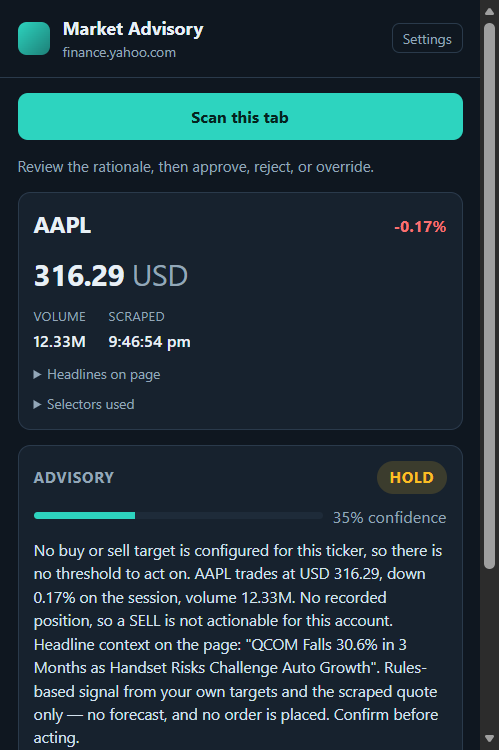
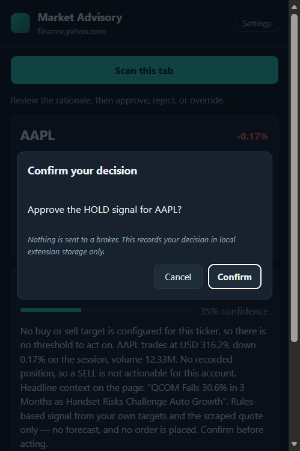
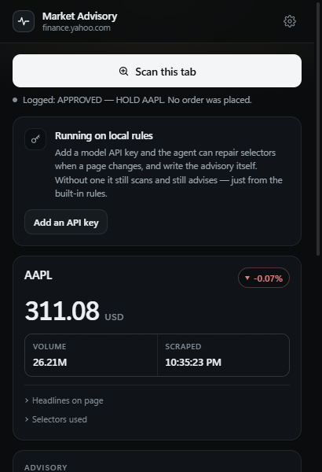
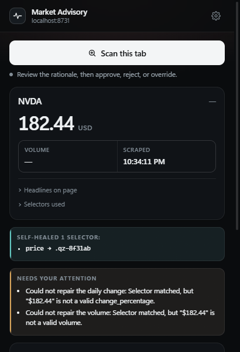
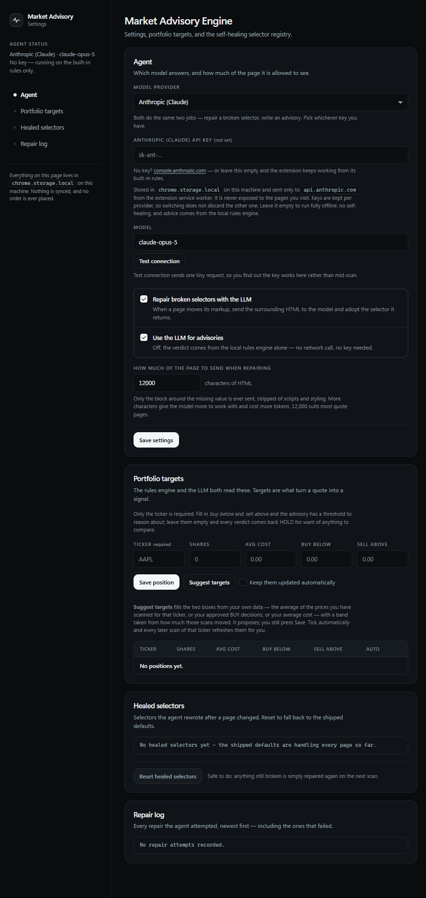
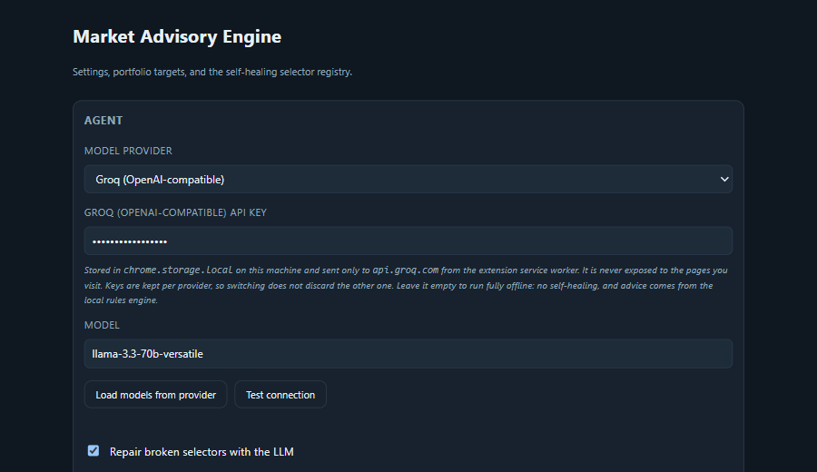

# Demo script

Roughly three minutes, in the order a judge will want to see it. Every
screenshot below is a real capture from a real browser run, not a mockup.

## Setup (before you present)

```bash
npm install && npm run check     # 139 tests, static bundle validation
```

Load it: `chrome://extensions` (or `edge://extensions`) → **Developer mode** →
**Load unpacked** → pick this folder. Optionally add an API key in the options
page — **Anthropic (Claude)** by default, or **Groq** if that is the key you
have; press **Test connection** and you will see which model answered. The demo
works without any key at all, it just loses self-healing and falls back to the
local rules engine for advisories.

Open two tabs ahead of time:

1. `https://finance.yahoo.com/quote/AAPL/` — the happy path.
2. `https://stockanalysis.com/stocks/aapl/` — a site whose markup has drifted,
   which is where healing earns its keep.

---

## 1. Scrape the tab you are already looking at (~40s)

On the Yahoo tab, click the toolbar icon → **Scan this tab**.



Say: *there is no server, no API of theirs, and no scraping farm. It reads the
tab already open in front of me, normalizes it into typed JSON, and stores it
locally.* Expand **Selectors used** — that list is the audit trail of exactly
which DOM hooks produced each number.

## 2. The human keeps the decision (~30s)

Click **Approve**.



Say: *the extension never places an order. Approve, Reject and Override all end
here, and all this button does is write the decision to local storage.*

Confirm, and the decision lands in the log with an explicit "No order was
placed."



## 3. Self-healing when the page changes underneath it (~60s)

Switch to the stockanalysis tab and scan. The shipped `[data-test="quote-change"]`
hook no longer exists on that site — the layout moved on.

With a key configured, the extension captures the surrounding container, strips
it (offscreen, so the active tab never stalls), asks Claude for a replacement
selector, validates the answer against the live DOM, and re-runs extraction with
no reload.



The interesting part of that screenshot is the **rejection**. A selector that
merely *resolves* is not yet a selector that is *right*: here the model pointed
the volume and change fields at the price node, and the extension refused both
because `$182.44` is not a plausible volume or percentage. It heals, but it does
not accept garbage — and the bad selector never reaches the registry.

Scan again and the healed selector is reused from `chrome.storage.local` with no
second model call.

## 4. Where the state lives (~20s)



Say: *the key is stored locally and only ever sent to the provider's own host.
The healed-selector registry is inspectable and resettable, and the repair log
records every attempt — including the ones that were refused.*

If someone asks what happens without an Anthropic key: switch the provider
dropdown to Groq. Same prompts, same schemas, same refusal logic — only the wire
format changes, and **Load models from provider** reads the live catalogue so
the model id is never a guess.



---

## If you are asked "what have you actually verified?"

- `npm run check` — 139 unit/integration tests plus static manifest and module
  graph validation.
- Real browser runs (`npm run e2e`, `npm run e2e:heal`) against
  **finance.yahoo.com** (all five fields, no healing), **stockanalysis.com** and
  **marketwatch.com** (four of five), **google.com/finance** (their Beta rewrite
  left no stable price hook, so that field is left to healing), and a locally
  served page with deliberately mangled markup to force the repair path.
- The packaged zip from `npm run package` was extracted and loaded as an
  extension, and the full scan → advise → approve → log flow re-run from it.
- Both providers answer from inside the service worker (`npm run e2e:provider`),
  and the repair loop was driven end to end in both wire formats.

## Known limits, stated up front

- `activeTab` means the extension can only read a tab *after* you invoke it from
  the toolbar. That is deliberate: there are no declared content scripts and no
  standing access to any site.
- Advisories are a rules engine plus an LLM rationale. They are not a forecast,
  and nothing is ever sent to a broker.
